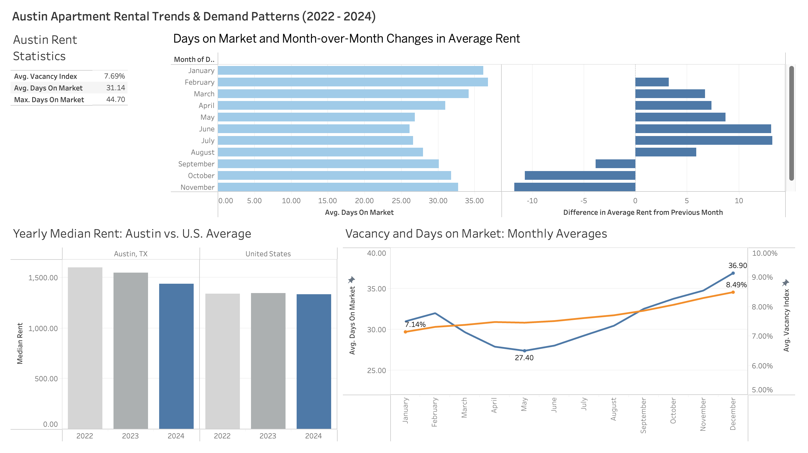

# Austin Apartment Rent Analysis (2022 - 2024)
Austin Apartment Rent Analysis of 2022 - 2024 using SQL and Tableau. 
* Interactive Tableau dashboard found [here](https://public.tableau.com/app/profile/seojin.yoon/viz/AustinApartmentRentAnalysis2022-2024/AustinApartmentRentalTrendsDemandPatterns2022-2024?publish=yes)

## Metrics & Dimensions
* **Location:** Austin,TX and United States
* **Vacancy Index:** Percentage(%) of available apartment units that are vacant or unoccupied
* **Days On Market:** Number of days an apartment unit is on the market
* **Median Rent:** Middle value of apartment unit rent price($) of overall bedroom sizes

## Datasets
* Apartment Rental Market datasets from Jan 2017 to Apr 2025 from [Apartment List](https://www.apartmentlist.com/research/category/data-rent-estimates)

## Objective
* Analyze apartment market data to demand patterns for renting an apartment in Austin.

### Data Questions
* When is the best time in the year for finding an apartment in Austin?
* Is Austin's apartment market becoming more of a heating or cooling market? 
* How have average rent prices in Austin changed in recent years? How does this compare to the U.S.?

## Summary of Insights

* The average price to rent an apartment in Austin in 2024 was $1,436.39. Apartment prices are lowest in December and highest from June through August.

* From 2022 - 2024, the average vacancy index was 7.69% and average days on market was 31.14 days, indicating Austin’s apartment market is likely entering a period of cooling. Throughout the year, demand is gradually declines from September to December. Demand is picks up again starting in January and becomes strong throughout the sumemr months of May to August, where rent prices grow significantly higher than each previous month.
    * Months from September to December are typically he best time to find an apartment in Austin, as it's enters a period of a cooling market. There are more apartment listing available at this time, they tend to stay on the market longer, and there's a slower rent growth month-over-month.

* Median Rent prices have been gradually decreasing in Austin and in the U.S. from 2022 - 2024. This decline aligns with Austin's direction towards a cooling market, likely due to increased apartment construction with shifts in demand. Austin's median rent was 7.17% higher than the U.S. national average in 2024.
